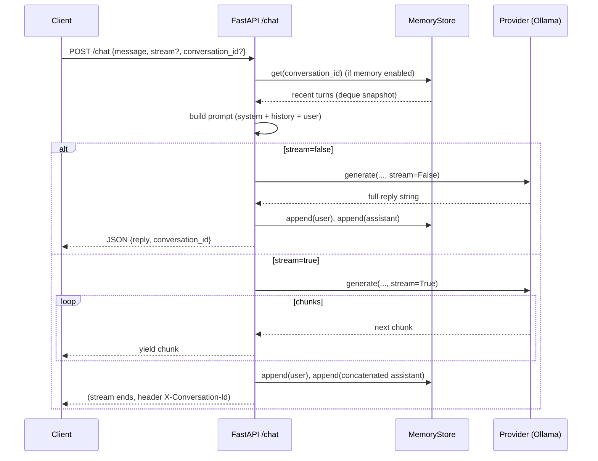

# `app.py` — Deep, Beginner‑Friendly Walkthrough


## 1) High‑Level Overview


At a glance, the `app.py` file does three big things:

1. **Sets up the web server** using FastAPI: defines endpoints like `/health`, `/agents`, and `/chat`.
2. **Loads configuration and helpers**: provider selection, prompt building, and the in‑memory memory store.
3. **Implements the `/chat` endpoint** that:
   - Builds the model prompt (system + short memory + current user message)
   - Calls the model provider (Ollama) in **non‑stream** or **stream** mode
   - Updates short memory when the model responds
   - Returns JSON (non‑stream) or a live **token stream** (streaming)

## 2) Key Imports & Why They Matter


Typical imports you’ll see in your `app.py` file and their purpose:

```python
from fastapi import FastAPI, HTTPException, Response, Request
from fastapi.responses import StreamingResponse
from pydantic import BaseModel, Field
from typing import Optional, Dict, Any, cast, AsyncIterator
from uuid import uuid4

from utils import config
from agents.general import load_system_prompt
from agents.base import build_prompt
from utils.memory import MemoryStore
from providers.base import ProviderError, GenerateReturn
```
- **FastAPI / StreamingResponse**: creates the web app and supports streaming HTTP responses.
- **Pydantic (BaseModel, Field)**: validates and documents request/response schemas.
- **typing / uuid4**: types for clarity and generating new `conversation_id` values.
- **utils.config**: reads `.env` settings like model name, memory flags, etc.
- **agents.general / agents.base**: loads the *system prompt* and composes the final prompt including short memory.
- **utils.memory.MemoryStore**: short conversation memory (recent turns per conversation).
- **providers.base.ProviderError**: lets us convert provider failures into clean API responses (HTTP 502).

## 3) Creating the FastAPI App & Memory Store


You initialize the FastAPI app with a title and version, then create a **MemoryStore** for short‑term memory.

```python
app = FastAPI(title="Pi Agent Server", version="0.3.0")

_memory = MemoryStore(
    max_turns=config.MEMORY_MAX_TURNS,
    ttl_seconds=config.MEMORY_TTL_MIN * 60,
    max_conversations=config.MEMORY_MAX_CONVERSATIONS,
)
```
- **`FastAPI(...)`**: configures the app metadata (helpful for docs, logs).
- **`MemoryStore(...)`**: keeps a deque (fixed‑length list) of recent turns per `conversation_id`:
  - `max_turns` → how many turns to keep
  - `ttl_seconds` → prune idle conversations
  - `max_conversations` → global cap (evict oldest if exceeded)

> If `ENABLE_MEMORY=false` in `.env`, the app simply **skips reading/writing** to this store.

## 4) Request/Response Models (Pydantic)


You define two Pydantic models: one for **incoming requests** and one for **responses**.
This ensures valid inputs (e.g., min message length) and consistent outputs.

```python
class ChatRequest(BaseModel):
    message: str = Field(min_length=1, max_length=4000)
    agent: str = Field(default="general")
    stream: bool = Field(default=False)
    conversation_id: Optional[str] = None

class ChatResponse(BaseModel):
    reply: str
    conversation_id: Optional[str] = None
    model: Optional[str] = None
    provider: Optional[str] = None
```
- **`ChatRequest`**: clients send a `message`, optional `agent`, a `stream` flag, and optionally an existing `conversation_id`.
- **`ChatResponse`**: server returns a `reply` and the `conversation_id`. We kept `model`/`provider` **optional** so you can omit them without errors.

## 5) Small Endpoints: `/health` and `/agents`


**`GET /health`** — Lightweight liveness check:

```python
@app.get("/health")
def health():
    return {"status": "ok"}
```

**`GET /agents`** — A simple list of available agents (for now, just `general`). You may return either a list or an object; here’s an object form:

```python
@app.get("/agents")
def agents():
    return {"agents": ["general"]}
```

## 6) The `/chat` Endpoint — Step by Step


The heart of the server: receives a message, builds a prompt, calls the provider, and returns a response.
It supports both **non‑stream** (return once) and **stream** (live token chunks) modes.

### 6.1 Handler signature and conversation ID


```python
@app.post("/chat", response_model=ChatResponse)
async def chat(req: ChatRequest, request: Request):
    convo_id = req.conversation_id or str(uuid4())
```
- The **function is async** so we can await I/O (HTTP calls to the provider).
- If the client didn’t send a `conversation_id`, we create a new one (`uuid4`).

### 6.2 Load short memory (if enabled)


```python
history = []
if config.ENABLE_MEMORY:
    history = await _memory.get(convo_id)
```
- Reads recent turns (a few user/assistant messages) for this conversation.
- This *history* will be placed **before** the new message so the model remembers context.

### 6.3 Build the final prompt (system + history + user)


```python
system = load_system_prompt()
prompt = build_prompt(system, req.message, history)
```
- **`load_system_prompt()`** loads your agent’s top‑level instructions (style, safety, tone).
- **`build_prompt(...)`** combines everything:
  1. `<system>…</system>`
  2. `<user>…</user>` / `<assistant>…</assistant>` blocks from recent history
  3. `<user>NEW_MESSAGE</user>`

### 6.4 Options sent to the provider


```python
options = {
    "temperature": config.TEMPERATURE,
    "num_ctx": config.CTX_TOKENS,
    "num_predict": config.MAX_TOKENS,
}
```
These are mapped to the provider (Ollama) under `options` in the JSON payload.
They control generation style and **hard caps** to preserve performance on a Pi.

### 6.5 Non‑stream path (simplest)


```python
if not req.stream:
    try:
        reply = await provider_generate(
            prompt, model=config.OLLAMA_MODEL_GENERAL, stream=False, options=options
        )
    except ProviderError as e:
        raise HTTPException(status_code=502, detail=str(e))

    # Update memory with the user question and assistant reply
    if config.ENABLE_MEMORY:
        await _memory.append(convo_id, "user", req.message)
        await _memory.append(convo_id, "assistant", reply)

    return ChatResponse(
        reply=reply,
        conversation_id=convo_id,
        # model=config.OLLAMA_MODEL_GENERAL,
        # provider=config.PROVIDER,
    )
```
- Calls the provider and waits for a **single** final string (`stream=False`).
- On success, it **appends** both the user and assistant turns to conversation memory.
- It returns a JSON body including the `conversation_id` (so the client can reuse it).

### 6.6 Streaming path (live tokens)


```python
try:
    gen = await provider_generate(
        prompt, model=config.OLLAMA_MODEL_GENERAL, stream=True, options=options
    )
except ProviderError as e:
    raise HTTPException(status_code=502, detail=str(e))

async def streamer():
    acc = []
    try:
        async for chunk in gen:
            acc.append(chunk)
            if await request.is_disconnected():
                break
            yield chunk.encode("utf-8")
    finally:
        if config.ENABLE_MEMORY:
            await _memory.append(convo_id, "user", req.message)
            if acc:
                await _memory.append(convo_id, "assistant", "".join(acc))

headers = {"X-Conversation-Id": convo_id}
return StreamingResponse(streamer(), media_type="text/plain; charset=utf-8", headers=headers)
```
- We get an **async iterator** from the provider and wrap it in a **StreamingResponse**.
- Each time we receive a chunk, we `yield` it to the client immediately.
- If the client disconnects, we stop (saves CPU) and still save any **partial** answer.
- We return the `conversation_id` in a **response header** (`X‑Conversation‑Id`) so the client can continue the thread even during streams.

## 7) Provider Design (Why Your App Code is Simple)


Your app doesn’t care whether the model backend is **Ollama** or (later) **OpenAI** — because providers share a **common interface**:

```python
# providers/base.py
class ProviderError(Exception):
    pass

GenerateReturn = Union[str, AsyncIterator[str]]

async def generate(prompt: str, *, model: str, stream: bool = False, options: Optional[Dict[str, Any]] = None) -> GenerateReturn:
    raise NotImplementedError
```
- **Non‑stream** → returns a **string** with the full reply.
- **Stream** → returns an **async iterator of strings** (chunks).
- The app uses this uniformly and focuses on HTTP and memory, not on backend details.

## 8) Error Handling & HTTP Status Codes


- **`ProviderError` → `HTTPException(502)`**: clear separation between *our* server and the provider (model backend). A 502 means the downstream model failed or was unreachable.
- **Validation errors (Pydantic)** → FastAPI returns **422** with details.
- **Unhandled exceptions** → FastAPI returns **500**; keep logs enabled for debugging.

## 9) Putting It All Together — Request Lifecycle




## 10) Tips, Gotchas, and Best Practices


- **Always capture `conversation_id`**: it’s in the JSON for non‑stream, and in the **header** for stream.
- **Respect caps**: `CTX_TOKENS`, `MAX_TOKENS`, and `MEMORY_MAX_TURNS` keep the Pi fast and reliable.
- **Client disconnects**: your code handles it — the stream stops early and partial output is still saved.
- **Future‑proofing**: adding OpenAI is as simple as writing `providers/openai.py` with the same `generate()` interface and using a provider loader mapping.

## 11) Full `app.py` Source (reference)

```python
# imports config from utils/config.py
# loads the system prompt via agents/general.py
# composes a final prompt using agents/general.py
# calls the active provider's generate(...)
# maps environment caps (temp, num_ctx...) to provider options
# returns a typed response model or raises HTTPException on provider errors


from fastapi import FastAPI, HTTPException
from pydantic import BaseModel, Field
from typing import Optional, Dict, Any

from utils import config
from agents.general import load_system_prompt
from agents.base import build_prompt

# Provider switch
if config.PROVIDER == "ollama":
    from providers.ollama import generate as provider_generate

# TODO when I implement more providers a simple if else wouldn't be enough and should be changed.
else:
    from providers.base import generate as provider_generate  # placeholder; raises NotImplemented

# creates FastAPI instance
app = FastAPI(title="Pi Agent Server", version="0.2.0")

# simple liveness check
@app.get("/health")
def health() -> dict:
    return {"status": "ok"}
# enumerate available agents
@app.get("/agents")
def list_agents() -> dict:
    return {"agents": ["general"]}


# --------- Chat schema ---------
"""
this is how FastAPI does validation (using these two classes). first class is what the client must send, second is what the api guarantees to return.
if the validation failsfastapi returns a '422 unprocessable entity' response with json body explaining the error.
"""
class ChatRequest(BaseModel):
    message: str = Field(..., min_length=1, max_length=4000)
    agent: str = Field("general", description="Only 'general' in Phase 1")
    stream: bool = False

class ChatResponse(BaseModel):
    reply: str
    model: str
    provider: str


@app.post("/chat", response_model=ChatResponse) # this line does two things at once, (1) @app.post("\chat") -> tells fastapi when the client sends
#http POST request to /chat, run this function.
#(2) response_model=ChatResponse -> whatever this function returns must be validated and shaped like ChatResponse.


async def chat(req: ChatRequest) -> ChatResponse: # (3)async function, input is validated against ChatRequest model.
    #(3) allows the function to pause and wait (with await) for slow operations without blocking the entire server.
    # if 10 users hit /chat at once, this allows the server to juggle them concurrently, without async it would proccess them one by one
    if req.agent != "general":
        raise HTTPException(status_code=400, detail="Unknown agent (only 'general' supported in Phase 1)")

    system = load_system_prompt()
    prompt = build_prompt(system, req.message)

    # Map simple options to Ollama
    options: Dict[str, Any] = {
        "temperature": config.TEMPERATURE,
        "num_ctx": config.CTX_TOKENS,
        "num_predict": config.MAX_TOKENS,
    }

    try:
        reply = await provider_generate( # calls the provider with the prompt.
            prompt,
            model=config.OLLAMA_MODEL_GENERAL, # TODO ollama_model_general should be changed when more providers are added
            stream=False,  # Phase 1 = non-stream
            options=options,
        )
        return ChatResponse(# wrap provider output into ChatResponse schema
            reply=reply,
            model=config.OLLAMA_MODEL_GENERAL, # TODO this should also be changed.
            provider=config.PROVIDER,
        )
    except Exception as e:
        raise HTTPException(status_code=502, detail=f"Provider error: {e}")
```
